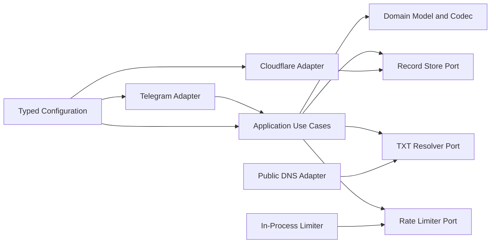
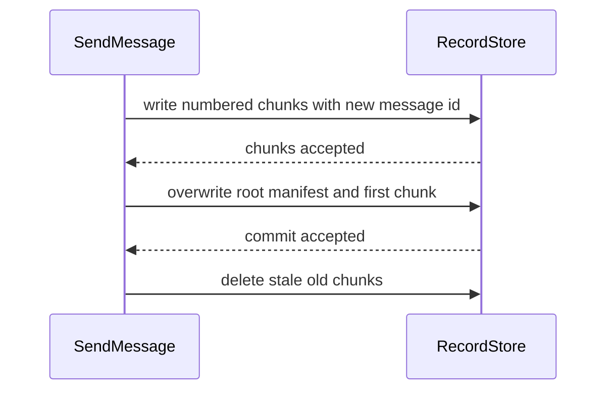
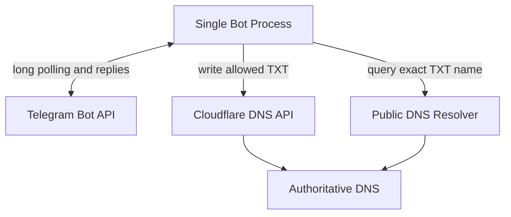

# ستون فقرات معماری بات پیامرسان مبتنی بر رکورد متنی دامنه

## اصلاح قطعی مقصد استقرار — کلودفلر ورکرز

مقصد قطعی استقرار نسخهٔ نخست کلودفلر ورکرز است. هر تصمیم قدیمی این سند دربارهٔ پایتون، دریافت طولانی تلگرام، پردازه یا کانتینر تکنمونهای، قفل یا محدودکنندهٔ درونحافظه، resolver سیستمی و خاموشسازی پردازه با قواعد این بخش جایگزین میشود.

- زبان و زمان اجرا: TypeScript روی Cloudflare Workers.
- ورودی تلگرام: webhook روی مسیر Worker؛ درخواست فقط با secret token معتبر تلگرام پذیرفته میشود.
- فراخوانی تلگرام و رابط کلودفلر: fetch و REST API؛ SDK پایتون و aiogram استفاده نمیشوند.
- خواندن عمومی TXT: DNS-over-HTTPS؛ وابستگی به resolver سیستمی وجود ندارد.
- هماهنگی توزیعشده: Durable Object مالک یگانهٔ پذیرش اتمی سهمیهٔ فرستنده و صندوق، ترتیب FIFO هر صندوق و dedup شناسهٔ update تلگرام است.
- Worker اصلی stateless است و صحت پیام جاری به حافظهٔ isolate وابسته نیست.
- رازها در Secret Store کلودفلر و تنظیمات غیرمحرمانه در vars و bindings نگهداری میشوند.
- lifecycle درخواستمحور است؛ long polling، shutdown drain و استقرار کانتینری حذف میشوند.
- Cron Trigger فقط برای reconciliation و پاکسازی دورهای استفاده میشود و صحت commit جاری به اجرای cron وابسته نیست.
- استقرار با Wrangler انجام و ثبت webhook پس از deploy بهصورت تکرارپذیر اجرا میشود.
- آزمون با Vitest و محیط آزمون Workers انجام میشود و همهٔ fetchها و Durable Objectها بدون اتصال واقعی آزموده میشوند.

## الگوی طراحی

معماری ششضلعی با سه ناحیه:

- هستهٔ دامنه برای نام صندوق، پیام، قطعه و قرارداد رمزگذاری
- لایهٔ کاربرد برای ارسال، خواندن و راهنما
- درگاهها و سازگارکنندهها برای تلگرام، کلودفلر، سامانهٔ نام دامنه، تنظیمات، زمان، محدودسازی نرخ و گزارش



قانون وابستگی: سازگارکنندهها به کاربرد و دامنه وابستهاند؛ کاربرد فقط به دامنه و تعریف درگاهها وابسته است؛ دامنه به هیچ کتابخانهٔ بیرونی وابسته نیست.

## قواعد و ناورداها

### AD-1 — مرز ششضلعی `[ADOPTED]`

- **Binds:** همهٔ قابلیتها
- **Prevents:** آمیختن منطق پیام و صندوق با قراردادهای تلگرام، کلودفلر یا حلکنندهٔ دامنه
- **Rule:** هستهٔ دامنه و کاربرد هیچ نوع، استثنا یا فراخوانی متعلق به کتابخانههای بیرونی را وارد نمیکنند؛ همهٔ ارتباطهای بیرونی از درگاه عبور میکنند.

### AD-2 — فرمانها فقط سازگارکنندهٔ ورودیاند

- **Binds:** `FR-1`، `FR-6` تا `FR-10`
- **Prevents:** دو پیادهسازی ناسازگار از رفتار فرمان و منطق کاربرد
- **Rule:** فرمانهای تلگرام فقط ورودی را تجزیه، نوعهای دامنه را میسازند، یکی از کاربردهای ارسال، خواندن یا راهنما را فراخوانی و نتیجه را به پیام تلگرام تبدیل میکنند.

### AD-3 — مالکیت یگانهٔ تغییر صندوق

- **Binds:** `FR-2`، `FR-4`، `SM-3`، `SM-4`
- **Prevents:** رقابت دو ارسال و ساختهشدن پیام ترکیبی
- **Rule:** نام معیارشدهٔ صندوق کلید مالکیت تغییر است. تمام ارسالهای همان کلید در یک پردازه بهترتیب اجرا میشوند و فقط کاربرد ارسال مجاز به فراخوانی درگاه نوشتن است.

### AD-4 — رکورد اصلی نقطهٔ ثبت پیام است `[ADOPTED]`

- **Binds:** `FR-4`، `FR-5`، `FR-8`، `SM-2`، `SM-4`
- **Prevents:** نمایش پیام ناقص یا ترکیب قطعههای دو نسخه
- **Rule:** هر پیام شناسهٔ یکتا دارد. قطعههای شمارهدار پیام جدید نخست نوشته میشوند؛ رکورد اصلی در آخر بهعنوان فهرست قطعهها ثبت میشود؛ سپس قطعههای قدیمی اضافی پاک میشوند. خواننده فقط مجموعهای را کامل میداند که شناسه، نسخه، شمار کل و شمارهٔ همهٔ قطعهها با رکورد اصلی سازگار باشند.



### AD-5 — جدایی مسیر نوشتن و خواندن

- **Binds:** `FR-2`، `FR-6` تا `FR-8`
- **Prevents:** استفادهٔ تصادفی از اعتبارنامهٔ کلودفلر برای خواندن عمومی یا نوشتن روی دامنهٔ دلخواه
- **Rule:** درگاه ذخیرهٔ رکورد فقط از رابط کلودفلر و فقط برای دامنههای مجاز مینویسد. درگاه حل رکورد فقط از سامانهٔ عمومی نام دامنه میخواند و هیچ توان تغییر ندارد.

### AD-6 — قرارداد واحد پیام و زمان

- **Binds:** `FR-3`، `FR-5`، `FR-8`، `SM-2`
- **Prevents:** قالبهای ناسازگار، ترتیب مبهم قطعهها و وابستگی داده به منطقهٔ زمانی سرور
- **Rule:** پیام مدیریتشده با رمزگذاری UTF-8 و قالب نسخهدار شامل شناسهٔ پیام، شماره و شمار قطعه، شناسهٔ عددی تلگرام، نام کاربری اختیاری، زمان UTC و متن است. نمایش زمان فقط در مرز ارائه به منطقهٔ زمانی ایران تبدیل میشود.

### AD-7 — تنظیمات نوعمند و توقف امن

- **Binds:** `FR-2`، `FR-9`، `FR-10` و حفاظهای امنیتی
- **Prevents:** اجرای ناقص با توکن، دامنه، کلید قابلیت یا عدد نامعتبر
- **Rule:** تنظیمات در راهاندازی یکبار اعتبارسنجی میشوند. رازها فقط از محیط میآیند؛ دامنههای مجاز معیار میشوند؛ سه کلید قابلیت مستقلاند؛ هر خطای تنظیمات پیش از شروع دریافت پیام پردازه را متوقف میکند.

### AD-8 — محدودسازی نرخ متناسب با استقرار

- **Binds:** حفاظت عملیاتی ارسال عمومی
- **Prevents:** دو محدودکنندهٔ ناسازگار یا تصور نادرست محدودیت سراسری در چند نمونه
- **Rule:** نسخهٔ نخست فقط یک نمونهٔ فعال دارد و محدودسازی نرخ در حافظه بر دو کلید مستقل شناسهٔ فرستنده و نام صندوق اعمال میشود. اجرای چند نمونه تا انتقال این مالکیت به ذخیرهٔ اشتراکی ممنوع است.

### AD-9 — خطا و گزارش مستقل از ارائهدهنده

- **Binds:** همهٔ کاربردها و نیازهای قابلیت مشاهده
- **Prevents:** افشای راز یا متن پیام و نشت خطاهای SDK به کاربر
- **Rule:** لایهٔ کاربرد فقط خطاهای طبقهبندیشدهٔ دامنه و کاربرد را برمیگرداند؛ سازگارکنندهٔ تلگرام آنها را به متن کاربر تبدیل میکند. گزارش ساختاریافته شامل شناسهٔ همبستگی، عملیات، مدت و نوع خطا است و هرگز توکن یا متن کامل پیام را ثبت نمیکند.

### AD-10 — استقرار تکپردازهای بدون پایگاه داده

- **Binds:** همهٔ قابلیتها و محیط عملیاتی
- **Prevents:** افزودن زودهنگام پایگاه داده، webhook و زیرساخت چندنمونهای ناسازگار با قفل و نرخسنج درونحافظه
- **Rule:** نسخهٔ نخست یک پردازه یا کانتینر با دریافت طولانی تلگرام است. تنها حالت پایدار محصول رکوردهای سامانهٔ نام دامنه است. پردازه پیش از شروع دریافت پیام، تنظیمات را اعتبارسنجی میکند و هنگام توقف، دریافت ورودی جدید را قطع و عملیات جاری را کامل میکند.

### AD-11 — قرارداد رکورد و مجموعهٔ رکورد

- **Binds:** `FR-4` تا `FR-8` و سازگارکنندههای کلودفلر و دامنه
- **Prevents:** تفاوت میان بهروزرسانی یک شناسهٔ رکورد و جایگزینی کل مجموعهٔ رکوردهای متنی همنام
- **Rule:** درگاه ذخیره فقط سه عملیات در سطح مجموعه دارد: ۱) خواندن همهٔ رکوردهای متنی یک نام؛ ۲) جایگزینی کل مجموعهٔ رکوردهای متنی یک نام با دقیقاً یک رکورد مدیریتشده؛ ۳) حذف کل مجموعهٔ رکوردهای متنی یک نام. نخستین ارسال، رکوردهای متنی قبلی همان نامهای درگیر را نیز جایگزین میکند. نتیجهٔ هر عملیات یکی از ساختهشد، بهروزرسانیشد، یافتنشد، مبهم یا نتیجهنامعلوم است. سازگارکنندهٔ کلودفلر مسئول تبدیل این قرارداد به شناسههای رکورد و آزمون قرارداد مشترک با درگاه جعلی است.

### AD-12 — قالب انتقالی قطعی پیام

- **Binds:** `FR-3`، `FR-5`، `FR-8` و تمام سازندگان و خوانندگان پیام
- **Prevents:** انتخاب مستقل قالب، گریزدهی، ترتیب رشتهها یا محاسبهٔ ظرفیت
- **Rule:** محتوای منطقی هر رکورد با پیشوند ثابت و نسخهٔ یک، سپس رمزگذاری بدون padding از JSON معیار UTF-8 حمل میشود. کلیدهای JSON و ترتیب معیار آنها عبارتاند از نسخه، شناسهٔ پیام، شمارهٔ قطعه، شمار قطعهها، شناسهٔ تلگرام، نام کاربری nullable، زمان UTC و بخش متن. سریالساز دامنه مالک ساخت و تفسیر envelope و تقسیم متن میان نامها است؛ سازگارکنندهٔ کلودفلر فقط envelope نهایی را به رشتههای حداکثر ۲۵۵ بایتی TXT تبدیل میکند و سازگارکنندهٔ DNS رشتههای هر RR را بهترتیب به یک envelope برمیگرداند. بردارهای طلایی برای فارسی، شکلک، نقلقول، ممیز معکوس و مرز ظرفیت میان همهٔ واحدها مشترکاند.

پیشوند انتقالی:

`tgdn1:`

رمزگذاری payload:

`base64url(canonical-json-utf8-without-padding)`

ترتیب کلیدهای معیار:

`v,id,i,n,uid,username,ts,text`

### AD-13 — ترتیب خطی ارسال و لغو

- **Binds:** `FR-4` و چرخهٔ پردازه
- **Prevents:** تفسیرهای متفاوت از آخرین ارسال کامل و commit درخواست قدیمی پس از درخواست جدید
- **Rule:** کاربرد ارسال هنگام پذیرش فرمان برای صندوق یک شمارهٔ ترتیبی افزایشی میسازد و درخواستها را در صف FIFO همان صندوق اجرا میکند. نقطهٔ خطیشدن، commit موفق رکورد اصلی است. لغو انتظار هیچ تغییری ایجاد نمیکند؛ لغو یا timeout پس از آغاز mutation به reconciliation ختم میشود؛ shutdown ابتدا پذیرش را میبندد و سپس صفهای پذیرفتهشده را تا بودجهٔ پایان کامل میکند.

### AD-14 — مالکیت یگانهٔ تلاش مجدد و reconciliation

- **Binds:** همهٔ فراخوانیهای کلودفلر و پاکسازی `FR-4`
- **Prevents:** ضربشدن retry در دو لایه، رکورد تکراری و اعلام شکست پس از commit واقعی
- **Rule:** فقط سازگارکنندهٔ کلودفلر retry هر فراخوانی منفرد را اجرا میکند و کاربرد کل تراکنش را کورکورانه تکرار نمیکند. timeout یا قطع پس از mutation نتیجهنامعلوم است و باید با خواندن دوبارهٔ مجموعه و تطبیق شناسهٔ پیام reconcile شود. عملیات جایگزینی و حذف idempotent برحسب نام معیار و شناسهٔ پیام هستند. خطاهای اعتبارسنجی و مجوز retry نمیشوند؛ خطای شبکه، محدودیت نرخ و خطای موقت ارائهدهنده حداکثر سه تلاش با تأخیر دو و چهار ثانیه و jitter دارند. مهلت هر فراخوانی پانزده ثانیه و بودجهٔ انتهابهانتها چهلوپنج ثانیه است.

### AD-15 — پاکسازی مشتقشدنی و بدون وضعیت پایدار محلی

- **Binds:** `FR-4`، `SM-4` و `AD-10`
- **Prevents:** نیاز پنهان به صف پایدار و گمشدن کار پاکسازی با restart
- **Rule:** بدهی پاکسازی فقط از manifest جاری و فهرست رکوردهای نامهای شمارهدار در کلودفلر مشتق میشود. پاکسازی idempotent پس از commit اجرا میشود؛ شکست آن ثبت میگردد و در ارسال بعدی همان صندوق و در پیمایش startup دوباره انجام میشود. صحت خواندن به پایان پاکسازی وابسته نیست و هیچ صف محلی پایدار ایجاد نمیشود.

### AD-16 — حالتهای قطعی خواندن

- **Binds:** `FR-7`، `FR-8` و سازگارکنندهٔ دامنه
- **Prevents:** انتخاب متفاوت رکورد مدیریتشده، اتصال نادرست رشتههای TXT یا پنهانکردن دادهٔ ناقص
- **Rule:** سازگارکنندهٔ DNS هر RR را به یک مقدار با قطعههای بایتی مرتب تبدیل و آنها را در همان RR متصل میکند؛ ترتیب RRهای همنام معنایی ندارد. کاربرد خواندن یکی از این حالتها را تولید میکند: `بدونپاسخ`، `فقطخام`، `یکپیامکامل`، `پیاممبهم` یا `پیامناقص`. فقط یک root مدیریتشده معتبر پذیرفته میشود؛ چند root معتبر حالت مبهم است. برنامهٔ پرسوجوی قطعهها فقط از شمار manifest و الگوی نام شمارهدار ساخته میشود. در حالت ناقص، مشخصات manifest، قطعههای موجود و تمام RRهای خام نمایش داده میشوند و پیام کامل اعلام نمیشود.

### AD-17 — قرارداد تنظیمات و مسیر ناحیه

- **Binds:** `FR-2`، `FR-10`، `AD-7` و composition root
- **Prevents:** parsing متفاوت فهرست، نگاشت مبهم دامنه به ناحیه و الزام رازهای قابلیت غیرفعال
- **Rule:** تنظیمات یک schema نسخهشده با نام، نوع، پیشفرض و کران ثابت دارند. نگاشت دامنهٔ مجاز به شناسهٔ ناحیه صریح است؛ همپوشانی دامنهها، تکرار پس از معیارسازی و دامنهٔ بدون ناحیه رد میشوند. اعتبارنامهٔ کلودفلر فقط هنگام فعال بودن ارسال و اعتبارنامهٔ تلگرام همیشه الزامی است. مقادیر بولی فقط شکلهای تعریفشده را میپذیرند و هر مقدار دیگر راهاندازی را متوقف میکند.

قرارداد تنظیمات:

| متغیر | نوع و قرارداد | پیشفرض |
| --- | --- | --- |
| `TELEGRAM_BOT_TOKEN` | رشتهٔ غیرخالی و محرمانه | ندارد |
| `CLOUDFLARE_API_TOKEN` | رشتهٔ غیرخالی و محرمانه؛ فقط هنگام فعال بودن ارسال | ندارد |
| `ALLOWED_ZONE_MAP` | شیء JSON از پسوند معیار به شناسهٔ ناحیه؛ نمونه در پایین | ندارد |
| `SEND_ENABLED` | فقط `true` یا `false` | `true` |
| `INBOX_ENABLED` | فقط `true` یا `false` | `true` |
| `HELP_ENABLED` | فقط `true` یا `false` | `true` |
| `DNS_TTL_SECONDS` | عدد صحیح از ۶۰ تا ۸۶۴۰۰ | `60` |
| `TIMEZONE` | نام معتبر پایگاه مناطق زمانی | `Asia/Tehran` |
| `RATE_SENDER_CAPACITY` | عدد صحیح مثبت | `5` |
| `RATE_MAILBOX_CAPACITY` | عدد صحیح مثبت | `3` |
| `RATE_WINDOW_SECONDS` | عدد صحیح مثبت | `60` |
| `PROVIDER_TIMEOUT_SECONDS` | عدد صحیح از ۱ تا ۳۰ | `15` |

نمونهٔ نگاشت ناحیه:

```json
{"salam.ifrom.ir":"cloudflare-zone-id"}
```

### AD-18 — محدودسازی اتمی و استقرار بدون همپوشانی

- **Binds:** حفاظت عملیاتی، `AD-8` و `AD-10`
- **Prevents:** مصرف ناقص یکی از دو سهمیه و دوبرابرشدن قفل و نرخ در استقرار rolling
- **Rule:** درگاه محدودسازی یک عملیات اتمی پذیرش با کلید فرستنده و صندوق دارد؛ هر تلاش پذیرفتهشده هر دو سهمیه را یکبار مصرف میکند و ردشدن هیچ سهمی مصرف نمیکند. الگوریتم پنجرهٔ لغزان با ساعت monotonic است؛ پیشفرض پنج تلاش در دقیقه برای فرستنده و سه تلاش در دقیقه برای صندوق است؛ ورودیهای بیکار پس از دو پنجره حذف میشوند. استقرار باید راهبرد Recreate با یک replica و بدون overlap داشته باشد؛ readiness پس از شروع polling و termination grace بیش از بودجهٔ انتهابهانتها است.

### AD-19 — دسترسی عمومی بدون فهرست مجاز کاربر

- **Binds:** `FR-1`، `FR-7`، `FR-9` و مرز امنیت نسخهٔ نخست
- **Prevents:** افزودن ناخواستهٔ فهرست مجاز یا استفاده از محدودسازی نرخ بهعنوان احراز هویت
- **Rule:** نسخهٔ نخست هیچ فهرست مجاز شناسهٔ تلگرام و هیچ رمز مشترکی ندارد. هر کاربر بات میتواند از قابلیت فعال استفاده کند. شناسهٔ عددی فقط برای انتساب پیام و محدودسازی نرخ است؛ رد درخواست فقط بر پایهٔ اعتبار فرمان، دامنهٔ مجاز، کلید قابلیت و سهمیهٔ نرخ انجام میشود.

### AD-20 — کامل بودن خروجی خواندن و قطعههای تلگرام

- **Binds:** `FR-7`، `FR-8` و سازگارکنندهٔ تلگرام
- **Prevents:** حذف رکوردهای ناشناس در حضور پیام مدیریتشده یا بریدن پاسخ بلند
- **Rule:** نتیجهٔ کاربرد خواندن دو مجموعهٔ مستقل دارد: تفسیر پیام مدیریتشده و فهرست تمام RRهای خام دریافتشده. سازگارکنندهٔ تلگرام همیشه همهٔ RRهای خام را نمایش میدهد، حتی وقتی یک پیام کامل مدیریتشده نیز بازسازی شده است. خروجی بلند پیش از ارسال روی مرز نویسهٔ معتبر به قطعههای حداکثر ۴۰۹۶ نویسهای تقسیم میشود؛ هر قطعه سربرگ شماره و شمار کل دارد و ترتیب ارسال حفظ میشود.

### AD-21 — کمترین دسترسی اعتبارنامهٔ کلودفلر

- **Binds:** `FR-2`، `AD-5`، `AD-7` و حفاظهای امنیتی
- **Prevents:** استفاده از کلید عمومی حساب یا توکن دارای دسترسی به ناحیههای نامرتبط
- **Rule:** تنها اعتبارنامهٔ پذیرفتهشده توکن API محدود به مجوز ویرایش رکوردهای سامانهٔ نام دامنه و فقط ناحیههای موجود در `ALLOWED_ZONE_MAP` است. کلید عمومی حساب ممنوع است. راهنما و گزارشها توکن یا شناسههای داخلی ناحیه را نمایش نمیدهند؛ startup دسترسی را با یک عملیات فقطخواندنی روی هر ناحیه بررسی میکند و در صورت نبود دسترسی لازم متوقف میشود.

## قراردادهای سازگاری

| موضوع | قرارداد |
| --- | --- |
| نامها | نوعها مفرد و فایلها snake_case؛ درگاهها با پسوند `Port` و سازگارکنندهها با پسوند `Adapter` |
| نام صندوق | حروف کوچک، بدون نقطهٔ پایانی، شناسهٔ بینالمللی معیار؛ کنترل دامنه بر مرز برچسب نه پسوند رشتهای |
| شناسهها | شناسهٔ پیام UUID؛ شناسهٔ تلگرام عدد صحیح بدون فرض ۳۲بیتی |
| زمان | ذخیره UTC؛ نمایش `Asia/Tehran`؛ قالب نمایشی یکنواخت |
| داده | متن UTF-8؛ قالب پیام دارای نسخه؛ برش فقط روی مرز بایت معتبر UTF-8 |
| خطا | دستههای اعتبارسنجی، قابلیت غیرفعال، محدودیت نرخ، نبود رکورد، پیام ناقص، خطای موقت و خطای ارائهدهنده |
| تغییر حالت | فقط کاربرد ارسال از `RecordStorePort` استفاده میکند |
| گزارش | رخداد ساختاریافته، شناسهٔ همبستگی، بدون راز و متن کامل پیام |
| تنظیمات | یک شیء immutable پس از راهاندازی؛ هیچ خواندن پراکندهٔ محیط در ماژولها |

## پشتهٔ اولیه

نسخهها در زمان تدوین از نمای زندهٔ بستهها بررسی شدهاند؛ پس از ایجاد پروندهٔ قفل، نسخههای دقیق در آن ثبت خواهند شد.

| نام | نسخه |
| --- | --- |
| Python | 3.13.15 |
| aiogram | 3.31.0 |
| cloudflare | 5.6.0 |
| dnspython | 2.8.0 |
| pydantic-settings | 2.15.0 |
| structlog | 26.1.0 |
| pytest | 9.1.1 |
| ruff | 0.16.5 |

## بذر ساختاری

```text
tg_dns_bot/
  pyproject.toml
  src/tg_dns_bot/
    domain/          # صندوق، پیام، قطعه، codec و خطاهای دامنه
    application/     # کاربردها و تعریف درگاهها
    adapters/
      telegram/      # فرمانها و نمایش پاسخ
      cloudflare/    # نوشتن رکوردهای مدیریتشده
      dns/           # خواندن عمومی رکورد متنی
      rate_limit/    # محدودکنندهٔ درونحافظه
    config.py        # تنها مالک خواندن و اعتبارسنجی محیط
    observability.py # گزارش و شناسهٔ همبستگی
    main.py          # composition root و چرخهٔ پردازه
  tests/
    unit/            # دامنه و کاربرد با درگاههای جعلی
    integration/     # قرارداد سازگارکنندهها
    acceptance/      # سناریوهای FR و SM
```



## نگاشت قابلیت به معماری

| قابلیت یا ناحیه | محل | قواعد حاکم |
| --- | --- | --- |
| `FR-1` تا `FR-6` | `application/send_message` و سازگارکنندهٔ کلودفلر | `AD-2` تا `AD-7` |
| `FR-7` و `FR-8` | `application/read_inbox` و سازگارکنندهٔ DNS | `AD-2`، `AD-4` تا `AD-6` |
| `FR-9` و `FR-10` | `application/show_help`، تلگرام و تنظیمات | `AD-2`، `AD-7` |
| امنیت و قابلیت مشاهده | تنظیمات، composition root و گزارش | `AD-7`، `AD-9`، `AD-10` |
| آزمونهای موفقیت | `tests/acceptance` | همهٔ قواعد مرتبط با شناسهٔ هر معیار |

## موارد واگذارشده

- جزئیات کلاسها و امضاهای پایتون برای درگاه رکورد به داستان پیادهسازی واگذار شده است؛ معناشناسی سطح مجموعه و ردهبندی نتیجه در `AD-11` الزامآور است.
- تصویر پایه، میزبان و ابزار تحویل، تا داستان استقرار؛ `AD-18` استقرار تک نمونه و بدون همپوشانی را الزام میکند.
- مهاجرت به webhook یا چند نمونه، تا نیاز واقعی؛ مستلزم بازطراحی مالکیت قفل و محدودسازی نرخ است.
- افزودن ذخیرهٔ پایدار برای کار پاکسازی، تا زمانی که reconciliation مشتقشدنی `AD-15` در عمل ناکافی ثابت شود.
- متن دقیق پاسخها و راهنما، تا داستان سازگارکنندهٔ تلگرام؛ طبقههای خطا و اطلاعات الزامی PRD باید حفظ شوند.
